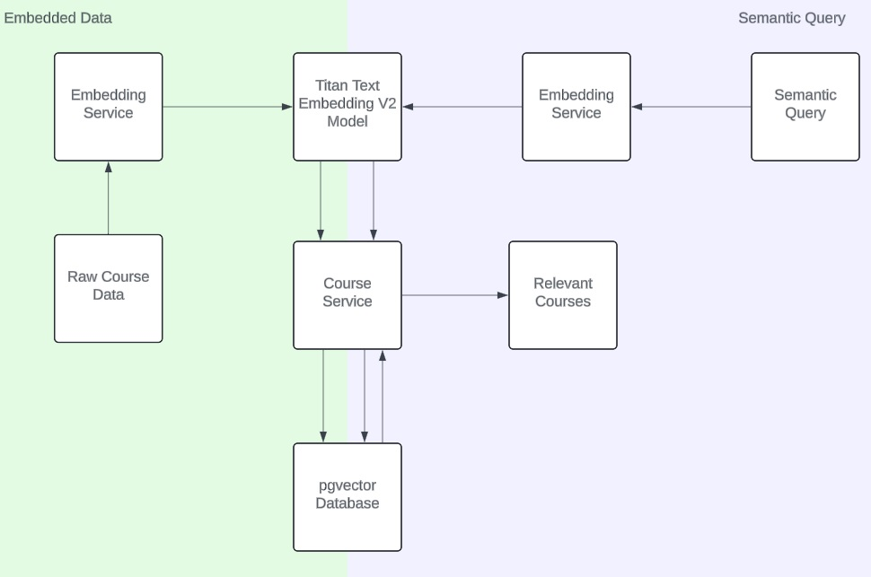
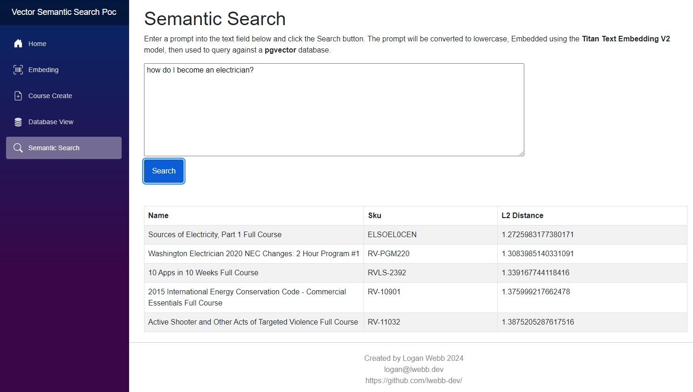

# Vector Semantic Search Proof of Concept

Simple .NET Blazor app demonstrating AI driven Semantic Search using Embeddings and a Vector Database.

## Workflows

## Technologies Used

- [Amazon Bedrock](https://aws.amazon.com/bedrock/): AWS service that permits access to a wide variety of foundation models from leading AI companies.
- [Amazon Titan](https://aws.amazon.com/bedrock/titan/): Foundation Models used for this PoC.
- [PostgreSQL](https://www.postgresql.org/): Serves as both the data layer for our Course data as well as a host for our vector database.
- [pgVector](https://github.com/pgvector/pgvector): psql extension essentially turning our existing PostgreSQL database into a Vector database.
- [.NET 8.0](https://dotnet.microsoft.com/en-us/download/dotnet/8.0): Latest version of .NET at the time this PoC was created.
- [Blazor](https://dotnet.microsoft.com/en-us/apps/aspnet/web-apps/blazor): Container for our entire application. Includes Frontend and Backend implementation.
- [Docker](https://www.docker.com/): Used for local development, deploys postgres database in an isolated container.
- [Entity Framework](https://learn.microsoft.com/en-us/aspnet/entity-framework): ORM for our .NET application.

## Local Setup

### AWS

**NOTE:** This PoC requires an AWS account in order to pass IAM credentials into the `AmazonBedrockRuntimeClient`.
The AWS account will also need access to Amazon Bedrock with access granted to the following models:

- Titan Text Embeddings V2

**Please be aware that usage of this application may incur costs to the AWS account used depending on the volume of embedding requests.**

1. Navigate to the `/src` directory.
2. Duplicate the `appsettings.json` file and rename it `appsettings.Development.json`.
3. Update `appsettings.Development.json` with your AWS `AccessKeyId`, `SecretAccessKey`, and `SessionToken` secrets.

### Postgres/pgvector

For the easiest setup method, simply use `docker-compose.yml` which leverages the [akane/pgvector](https://hub.docker.com/r/ankane/pgvector) Docker image.
This image already has postgres set up as well as the pgvector extension plugin already installed, 
and by using docker compose, it includes and runs `~/docker/pgvector.init.sql` which enables the pgvector extension.

1. In `appsettings.Development.json`, update `DefaultConnection` with your postgres connection string.

### Docker

**NOTE:** If you plan to use your own instance of postgres, you can skip this section.

1. Ensure the Docker Daemon is installed and running on your local.
2. Navigate to the repository root directory.
3. Duplicate `[.env]template.txt` and rename it to `.env`.
4. Update `.env` with the `POSTGRES_PASSWORD`, `POSTGRES_USER`, and `POSTGRES_DB` values used for your Connection String.

## Build Application

1. Using Visual Studio, open VectorSemanticSearchPoc.sln.
2. Apply the latest Entity Framework migrations by running `Update-Database` in the Package Manager Console while your postgres database is running.
3. Rebuild the solution, esnure there are no build errors.
4. If using the included Docker Postgres database implementation, run `docker compose up -d` from the repository root directory. Ensure the database container starts without error.
5. Debug the application in Visual Studio using the `https` launch profile (you will likely be prompted by windows to generate a self-signed cert, simply allow this and continue).
6. The Blazor app should now be running at `https://localhost:7061`.

